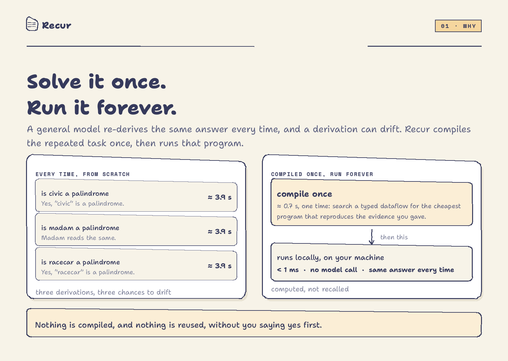
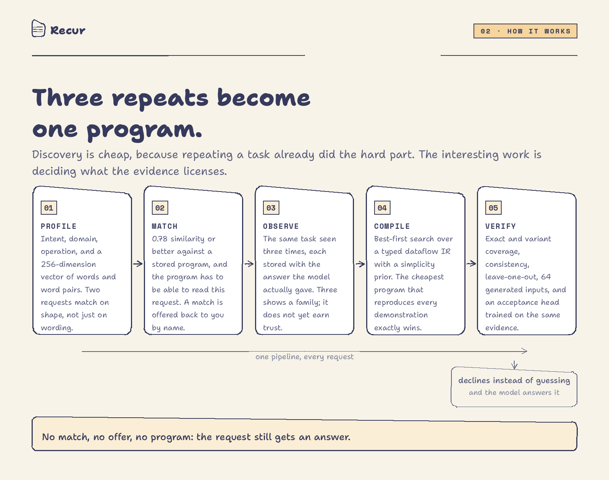
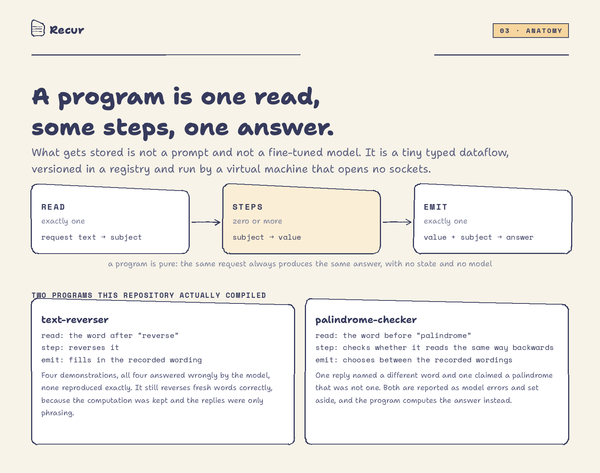
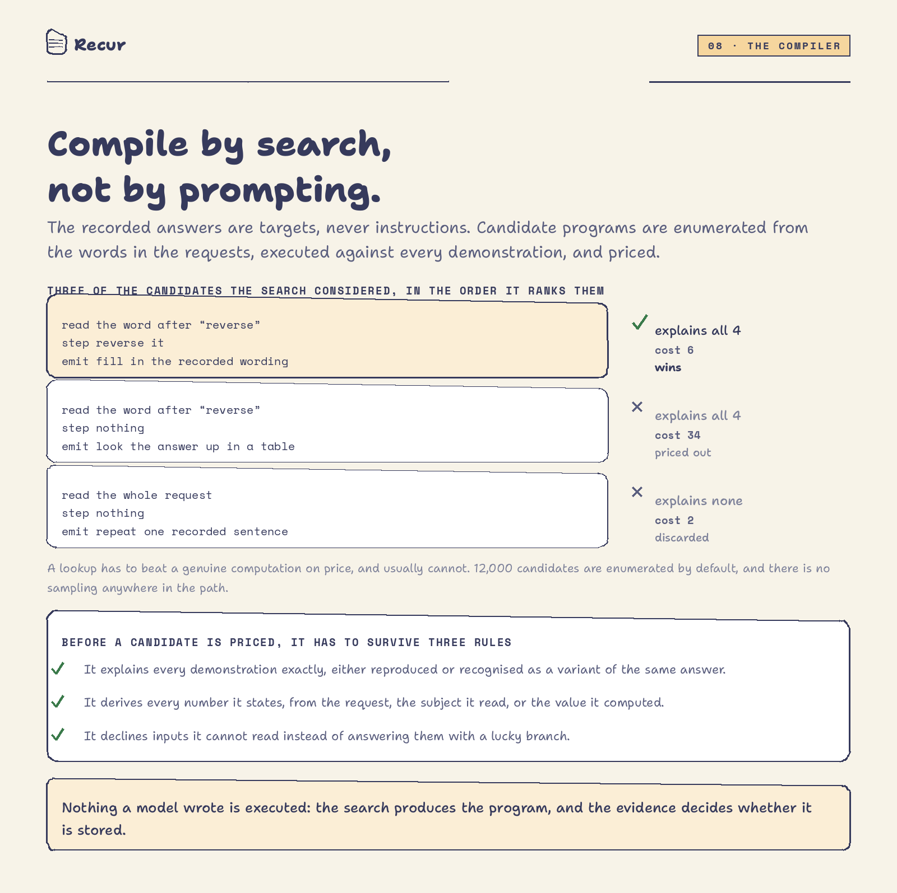
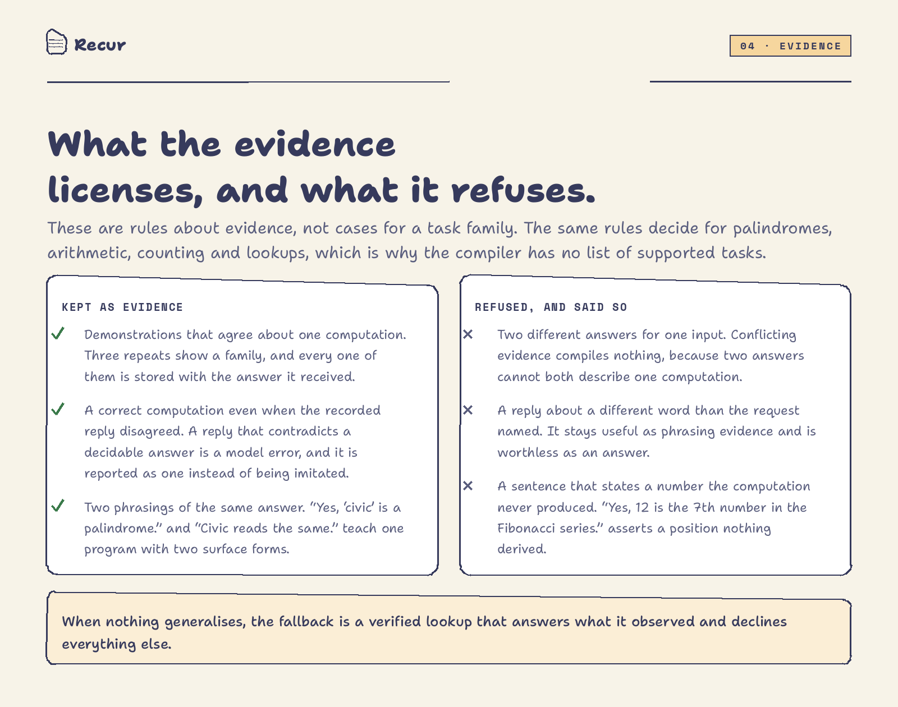
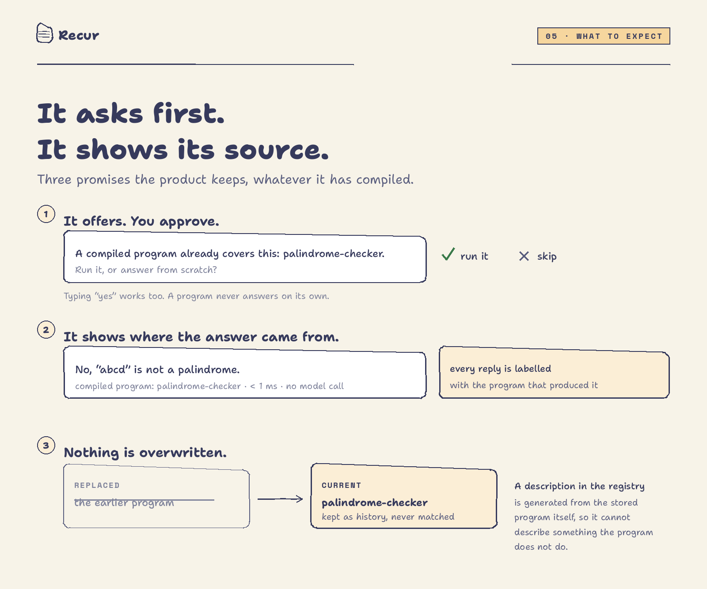
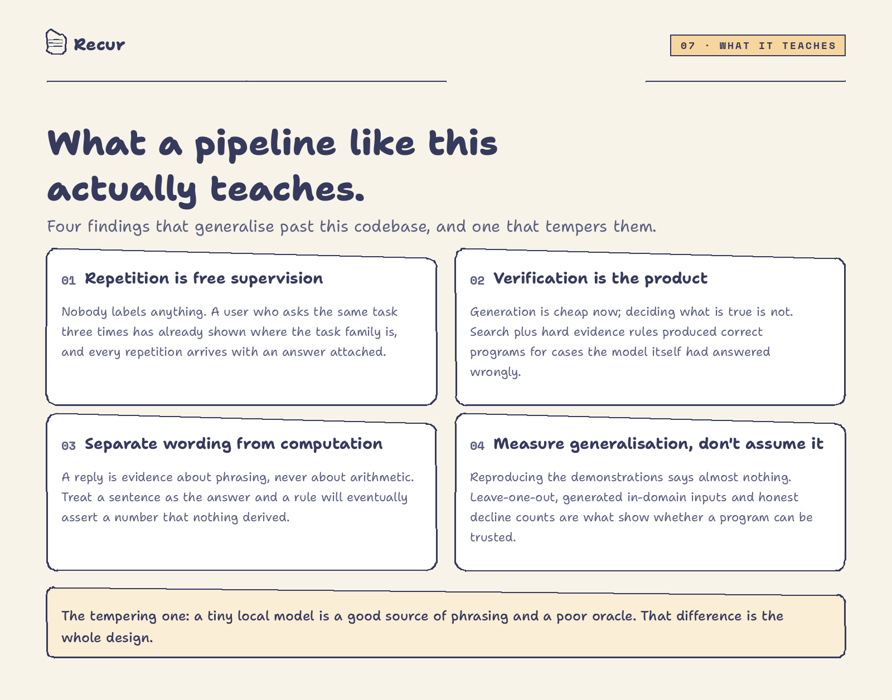
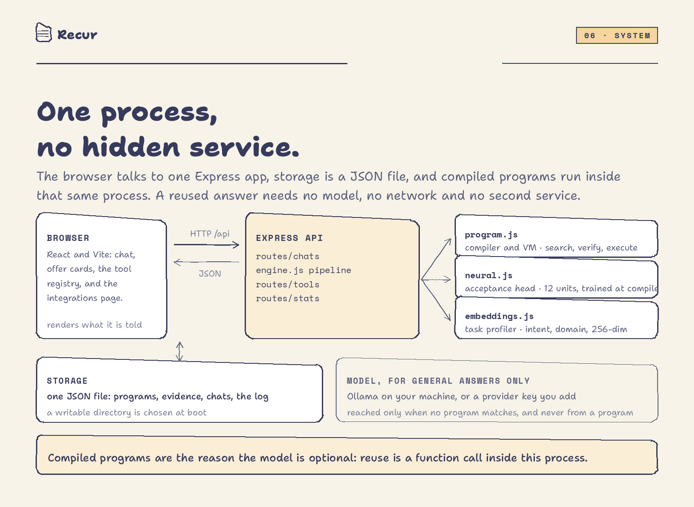

# Recur

**A chat workspace that compiles what you repeat into programs you own.**

Recur is not a better chatbot. It is an experiment in a different division of labour between a language model and a machine. A model is good at producing language and bad at being reliably right. So in Recur the model supplies *phrasing* and *candidate tasks*, while arithmetic, string handling and decisions about what is true are handed to a small compiler that produces an ordinary, inspectable, deterministic program.

<p align="center">
  
</p>

Ask it the same kind of question a few times and it will notice, ask permission once, then compile a reusable program from the answers you actually got. From then on that task is answered locally, in under a millisecond, with no model call, and the registry shows exactly what the program is, what it was compiled from, and how it behaves when it cannot answer.

The interesting part of the project is not the chat interface. It is the pipeline behind it: how a repeated request becomes a specification, how noisy model answers are turned into evidence, and how the system decides what that evidence is allowed to conclude.

---

## 1. The problem: a model that re-solves the same thing forever

Chatbots are stateless problem solvers with a memory of text attached. Every request arrives as a fresh derivation, so the same question asked three times is three full passes through a large model:

- **It costs the same every time.** Nothing about the second pass benefits from the first.
- **It takes seconds, every time.** In this repository's own measurements a general answer averages around 3.9 seconds, and the fastest tier still spends a full model call.
- **It drifts.** Ask the same thing three ways and you get three answers with three different wordings, and sometimes three different conclusions. One of the palindrome replies captured by this project claims a false palindrome, and another answers about a different word than the one requested. Both are recorded in the screenshots and the tests.
- **It cannot accumulate work.** There is no artifact at the end. The effort spent on yesterday's task is gone.

That last point is the real one. A system that cannot accumulate anything cannot get better at your work; it can only get better at talking about it.

## 2. The idea: repetition is a specification

Recur's wager is that a user who asks the same task three times has already done the expensive part: they have identified a task family, and every repetition comes with an answer attached. That is a supervision signal nobody had to label by hand.

So the pipeline is built to do three things, in this order of importance:

1. **Decide what the evidence licenses.** Not "answer the question": decide whether a computation exists that explains the demonstrations, and refuse when it does not.
2. **Produce an artifact that can be executed and checked**, rather than a promise printed in a chat bubble.
3. **Only then use the model**, for language, and for the cases where nothing was compiled.

Everything else follows from that. Programs are compiled by *search* rather than by prompting, because a search result can be verified and a prompt result cannot. Wording is inferred separately from computation, because a sentence is evidence about phrasing and never evidence about arithmetic. A program that cannot read a request declines instead of guessing. A program is never run without being offered first. The registry describes each program from the program itself, so the description cannot drift away from the behaviour.

## 3. How it works, in order

<p align="center">
  
</p>

**1. Profile.** Every request is reduced to a task profile: intent, domain, operation, and a 256-dimension hashed vector built from its words and word pairs (unigrams plus 0.75-weighted bigrams, L2 normalized). Two requests are considered the same task only when the *shape* agrees, not merely the wording. A cosine similarity between vectors is a tie breaker, never the whole decision, which is what stops "is abdor a palindrome" and "what is the capital of france" from ever collapsing into one family.

**2. Match.** The profile is compared with every stored program using a hybrid score: same shape contributes a high base (0.86 for parametric families, 0.76 with enough content overlap), different shapes start low and can only climb on real overlap. A score of **0.78** or better makes a program a candidate, and the program also has to be able to *read* the request. A match becomes an offer that names the program, never a silent substitution.

**3. Observe.** No match means the request is stored as a pending observation together with the answer it received. When **three** requests cluster into one family, Recur offers to compile them. Three is deliberately low: it is enough to see a shape and not nearly enough to trust it, which is exactly why compilation is a separate, heavily verified step.

**4. Compile.** A best-first search over a typed dataflow IR enumerates candidate programs, scored by a simplicity prior, and keeps the cheapest one that reproduces every demonstration exactly. Nothing is prompted here; the model's only role in this stage is that its recorded answers are the targets the search has to hit.

**5. Verify.** The winner is graded: exact and variant coverage of the demonstrations, full consistency, leave-one-out generalisation when there are enough demonstrations, 64 generated in-domain inputs, and a small acceptance head trained on the same evidence. Then the program runs your original request and answers it, locally.

**6. Reuse.** The next time a matching request arrives, the program is offered by name with its match score and its recorded task. Nothing runs until you pick it (typing "yes" counts). A compiled answer is labelled in the chat with the program that produced it, its latency, and the fact that no model was called.

Two exits matter as much as the happy path. A program that cannot read a request **declines**, and the request goes back to the model. And if no computation explains the evidence, Recur says so in the details card and either compiles a verified lookup or compiles nothing.

## 4. What a compiled program actually is

<p align="center">
  
</p>

A compiled program is a three-part typed dataflow:

| Part | Cardinality | Meaning |
| --- | --- | --- |
| `read` | exactly one | request text to a subject: the quoted span, the word anchored to a keyword, the number, the ordinal, the arithmetic expression, |
| `steps` | zero or more | pure transforms on the subject: reverse, lowercase, count vowels, check a palindrome, add, take the nth prime, |
| `emit` | exactly one | value plus subject to answer text: return the value, fill in recorded wording, choose between two recorded branches, or look the answer up |

There are **13 readers, 41 transforms and 5 emitters** (`server/src/program.js`). That is a deliberately small language. It cannot loop, allocate, read a file or open a socket, so an executed program is a pure function of its input: the same request always produces the same answer, forever. The VM is the only thing that runs it, and the registry stores the versioned artifact, the demonstrations, the verdicts, and the metrics that describe it.

Because the language is small, some tasks simply have no program. That is treated as a fact to report, not a failure to hide: the fallback is a *verified lookup* that answers only the inputs it actually observed and declines everything else.

## 5. The compiler: search, not prompting

This is the central design decision, and it is worth stating plainly: **anything a model writes cannot be verified, so nothing a model writes is executed.**

<p align="center">
  
</p>

Instead, compilation is a search. From the demonstrations, candidate structure is extracted (keywords that appear in every request, quoted spans, numbers, ordinals, arithmetic expressions), and from that structure the compiler enumerates programs: every reader, every transform chain up to a depth of two, every emitter, with a search budget of 12,000 candidates by default. Each candidate is executed against every demonstration. The winner is the cheapest program that reproduces all of them, where "cost" is a simplicity prior (`STEP_COST`) that charges for special-cased comparisons and for emitters that emit fixed text instead of deriving it. A lookup that happens to fit has to beat a genuine computation on price, and usually cannot.

Three properties follow from doing it this way:

- **Auditability.** The chosen program is in the registry, in a language small enough to read. Every claim in the details card is a computed fact about that artifact.
- **Determinism.** The same evidence and the same seed produce the same program. There is no sampling anywhere in the compile path.
- **A clean failure mode.** When no program fits, the answer is "no program", which the product can act on. A prompted contract has no such state; it always returns something.

The register is also where the project's most useful distinction lives: **the search fits two separate things, the computation and the wording.** The computation must explain the value in every demonstration. The wording is learned as surface form, separately, from the sentences the model happened to produce, and it is allowed to be inconsistent as long as it says the same thing. That separation is what lets Recur compile a correct reverser out of four replies that all reversed the word wrongly.

## 6. What the evidence is allowed to conclude

<p align="center">
  
</p>

Most of the engineering in this project went into refusals rather than features. The rules are general, and they are what stop the compiler from quietly becoming a machine for restating the model's mistakes:

**Agreement, or nothing.** Observations without a recorded answer are not evidence. Two different answers for one input are conflicting evidence, and conflicting evidence compiles nothing: two answers cannot both describe one computation. Conflicted inputs are counted and reported rather than silently dropped.

**Decidable operations are computed, not obeyed.** When a request names a computation with one correct answer (a reversal, a palindrome, an arithmetic expression, a count over a named span), the computation is the authority. A recorded reply that disagrees with it is recorded as a *fault* with a specific reason, shown in the registry, and set aside. This is the rule that produced a correct palindrome checker from a reply that claimed a false palindrome.

**Variants are the same answer in different words.** "Yes, 'civic' is a palindrome." and "Madam reads the same." are one program with two surface forms. Opposite answers are never variants, so a wrong branch cannot sneak in through that door.

**A program may only state numbers it derived.** Every number in an answer has to come from the request, from the span the program extracted, or from the value it computed. A recorded sentence that asserts a position nothing computed, for example *"Yes, 12 is the 7th number in the Fibonacci series."*, is refused as evidence, because a rule that imitates it asserts a fact it never established. This rule was added after exactly that program was found in a live registry, and the boot-time repair now retires any stored rule that can no longer derive what it says.

**Nothing is invented to fill a gap.** If a metric cannot be measured, it says so. With two demonstrations, leave-one-out reports that it needs at least three rather than printing a number that means nothing.

## 7. The acceptance head, and why it is tiny

Each compiled program carries a small neural network trained at compile time: **256 hashed input features, 12 hidden units with tanh activations, one output**, trained with momentum SGD (420 epochs, learning rate 0.6, momentum 0.9, L2 2e-4) on the tool's own demonstrations as positives and a set of distractors plus generated in-domain inputs as negatives, under a balanced deterministic split. Its separating threshold is learned and clamped to a conservative range instead of being fixed by hand.

Its job is *not* to answer anything. It answers one question: is this new request inside the input distribution this program was compiled from? A program with no head attached is never blocked by one; a head can only decide whether a match is close enough to be worth putting in front of you, and it reports its own confidence on the offer card. It costs microseconds and a few thousand stored floats, and it runs in the same process as everything else.

Honesty about it matters: trained on a handful of examples, its holdout accuracy is a weak signal, and the registry says how many examples that accuracy came from. It is a prior, and it is treated as one.

## 8. Verification: what makes a program trustworthy

A compiled program is only as good as the claims made about it, so every one of them is computed:

| Check | What it establishes |
| --- | --- |
| Consistency | all demonstrations are explained: reproduced exactly, recognised as a variant, or reported as a model error with a reason |
| Leave-one-out | the program recompiles without one demonstration and still answers it, which is the only real evidence of generalisation |
| Stress test | 64 generated in-domain inputs: executed, declined, crashed and deterministic counts, all reported |
| Decline behaviour | inputs the rules do not cover are refused rather than answered by a lucky branch |
| Acceptance head | confidence on new requests, trained on the same evidence and reported with its sample size |

The registry and the details card show these numbers as they are, including the unflattering ones. A program whose replies were all wrong is still a good program if the computation was right; a program that cannot read a sentence is useless no matter how good its score was.

## 9. Reuse, and why it always asks

<p align="center">
  
</p>

A matching program is offered, never substituted silently. The reasoning is partly product and partly research: an answer produced by a program the user did not ask for is indistinguishable from an answer produced by the model, so silently reusing a program hides the one behaviour the project exists to demonstrate. The user decides per request, and the reply says which program ran and that no model was called.

The rest of the contract is about not overclaiming:

- **Nothing is overwritten.** When a later compilation covers a task family better, the older program is kept as history, marked *replaced*, and never matched again.
- **Old artifacts are inert, not deleted.** Contracts saved before the compiler existed are marked *legacy* and can never execute, and a stored rule that no longer passes the current evidence rules stops being executable instead of quietly answering.
- **The copy is generated from the artifact.** Every registry description and task line is assembled from the same operation labels the VM traces at runtime, so a program that changes gets a description that changes with it. Deleting a program deletes its recorded runs too, so the reuse numbers describe the programs that exist.

## 10. What this project actually teaches

<p align="center">
  
</p>

**Repetition is free supervision.** Nobody labelled anything here. The dataset is an ordinary chat, and the moment a task repeats, the user has both identified the family and attached a target to it. That is a rare kind of free label: it is in-distribution by construction, it arrives with the request that produced it, and it needs no annotation interface. The pipeline's job is to be honest about how little three examples license.

**Verification is the product, generation is the commodity.** The clearest result in this repository is that a *worse* model makes a better demonstration of it. With a 0.5B local model the recorded replies were frequently wrong: all four demonstrations of one reversal task were reversed incorrectly, and two palindrome replies were about the wrong word or the wrong verdict. The compiled programs were right anyway, because correctness was never taken from the text. Generation is now cheap and everywhere; deciding what is true, and refusing to state what cannot be checked, is the scarce part.

**Separate wording from computation.** The single highest-value design decision was to treat a reply as evidence about *phrasing* and never as evidence about *arithmetic*. Sentences are interchangeable; values are not. The moment a sentence is treated as the answer, a rule can end up asserting a number nothing derived, and the failure is silent: the program reproduces its demonstrations perfectly while being wrong about everything else. The number rule exists because that failure was observed in a real registry, not because it was imagined.

**Measure generalisation, don't assume it.** Reproducing the demonstrations is nearly meaningless, because a memorised sentence reproduces all of them. What actually discriminates between a rule and a lookup is leave-one-out recompilation, generated in-domain inputs, and honest decline counts. Reporting the decline rate turned out to be as informative as reporting accuracy: a program that declines is a program whose boundary is known.

**And the tempering finding:** a small local model is an excellent source of phrasing and a mediocre oracle. Recur's design is essentially a set of walls built around that difference, and the walls matter more than the model.

## 11. Open problems this project ran into

These are real limitations, listed because pretending otherwise would contradict everything above.

- **One family can hide two tasks.** "Is 12 in the Fibonacci series?" and "What is the 10th element of the Fibonacci series?" are a membership question and an ordinal question, and a single similarity profile can place them in one family. The compiler notices that no single computation explains both and falls back to a verified lookup, which is safe but not clever. Splitting families by *question shape* rather than by domain is the obvious next step.
- **A lookup can repeat a non-answer.** If a model answered a repeated request with "I am not sure." three times, the verified lookup will reproduce that faithfully, exactly as documented. The system is honest about it and the numbers are visible, but it is not useful.
- **The acceptance head is data-starved.** Twelve hidden units trained on three examples is a prior, not a classifier. It earns its place by being cheap and by being unable to block anything, not by being accurate.
- **The operator library bounds what can be compiled.** 41 transforms cover strings, numbers, counts and lookups well and everything else badly. Growth here is a research question (which operators generalise) rather than an engineering one.
- **Storage is a single JSON file.** Fine for one process and for a demo; not a shared registry. On serverless hosts it is per instance and temporary.
- **Programs do not compose.** The registry holds one program per family. A pipeline that composes two compiled programs, and verifies the composition, is the natural next milestone and is not implemented.

## 12. The design decisions, and what each one costs

| Decision | Why | What it costs |
| --- | --- | --- |
| Compile by search, not by prompting | a search result can be verified against evidence; a prompt result cannot | compile time is real work (thousands of candidates, roughly a second) and only the operator library is reachable |
| A typed dataflow IR instead of generated code | purity, no I/O, auditable traces, safe to execute | expressive ceiling: tasks outside the 41 transforms become lookups or nothing |
| Evidence rules with explicit refusals | the label source is noisy by construction | some families compile nothing, and the UI has to admit that |
| A verified lookup as the only fallback | never guess, always be able to decline | it repeats observed answers verbatim, including bad ones |
| A 12-unit acceptance head instead of a model | microseconds, no network, no dependency | weak with few examples; used as a prior, never as an authority |
| Offer every reuse instead of auto-running | the user keeps the decision, and reuse stays visible | one click per reuse |
| Registry copy generated from the artifact | the description cannot outlive the thing it describes | copy is plain and mechanical rather than marketing |
| Legacy and superseded artifacts stay visible but inert | history is evidence too | the registry shows rows that cannot run |

## 13. The system

<p align="center">
  
</p>

One Express process serves the built React client and the API. Storage is a JSON file, whose writable location is chosen at boot. The compiler, the VM and the acceptance head are plain modules inside that process, so a compiled answer costs a function call. The model backend (Ollama locally, or a provider key you add) is only ever reached for general answers and for the phrasing used at compile time.

```
client/          React 18 + Vite 5 frontend: chat, offer cards, registry, integrations
server/src/
  app.js         Express app, static hosting, health check, Vercel path normalisation
  index.js       standalone entry that listens once the database is ready
  engine.js      the pipeline: profiling, clustering, offers, compilation, reuse
  program.js     the compiler, the IR, the VM, verification, and the registry copy
  neural.js      the acceptance head: hashed features, tiny network, sparse execution
  embeddings.js  task profiling and hybrid similarity
  llm.js         provider calls and tiers (quick, default, complex)
  routes/        chats, tools, stats, integrations, auth
  data/db.json   created on first run
api/index.js     serverless entry for Vercel
docs/figures/    the figures in this document, plus the script that draws them
```

## 14. API surface

All endpoints live under `/api`. The registry is intentionally public, because the numbers it shows are the point.

| Route | Methods | Purpose |
| --- | --- | --- |
| `/api/chats`, `/api/chats/:id` | GET, POST, DELETE | list, create, load, delete a chat |
| `/api/chats/:id/messages` | POST | run the pipeline for one request |
| `/api/chats/:id/retry` | POST | answer the last request again |
| `/api/chats/:chatId/offers/:messageId/resolve` | POST | accept or decline an offer (`use`, `create`, `general`, `clarify`) |
| `/api/tools` | GET, DELETE | the registry; DELETE clears it |
| `/api/tools/:id` | DELETE | delete one program and its recorded runs |
| `/api/stats` | GET | reuse rate, executions, latencies |
| `/api/integrations`, `/api/integrations/test`, `/api/integrations/active` | GET, PUT, POST, DELETE | provider keys, encrypted at rest |
| `/api/auth/register`, `/login`, `/logout`, `/me`, `/google`, `/github` | POST, GET | accounts, guest sessions, optional OAuth |
| `/api/health` | GET | liveness check |

## 15. Running it

Node 20 or newer, plus Ollama if you want the default local models. The general path needs a model; the compiled programs never do, so an offline install still demonstrates the whole of section 9.

```bash
npm run install:all                # client and server dependencies
ollama pull qwen2.5:0.5b           # default tier; llama3.1:8b for the deep tier
cp server/.env.example server/.env
npm --prefix server run dev        # API on http://localhost:8787
npm --prefix client run dev        # app on http://localhost:5173
```

Then ask the same kind of question three times. On the third, Recur will offer to compile the pattern; accept it, and the fourth request is a program run instead of a model call. `npm test` runs the backend suite (36 tests) covering the evidence rules, the compiler, the acceptance head, the pipeline, and the registry API.

Configuration is environment only, in `server/.env`: `PORT`, `CLIENT_ORIGIN`, `JWT_SECRET`, `INTEGRATION_ENCRYPTION_KEY`, `OLLAMA_BASE_URL`, `MODEL_QUICK` / `MODEL_DEFAULT` / `MODEL_COMPLEX`, and `PROGRAM_SEARCH_BUDGET` to move the compiler's search budget. Provider keys are never environment variables: they are added on the Integrations page, encrypted with AES-256-GCM, and selected per use.

## 16. Deploying, briefly

The server doubles as the web host: once `client/dist` exists, Express serves it and falls back to the app for non-API routes, so the repository deploys as one service. `api/index.js` plus `vercel.json` do the same on Vercel, and Render works with build `npm run setup` and start `npm --prefix server run start`.

Two caveats worth knowing before pointing someone at a deployment:

- **Storage is per instance and temporary on serverless hosts.** A Vercel function mounts the project read-only, so the database lands in the system temp directory: every warm instance has its own registry, and a redeploy wipes it. A shared registry needs a real store.
- **The default model runs on your machine.** Ollama needs a tunnel or a provider key added after the first deploy. Compiled programs keep answering regardless, which is the simplest way to show that they are not calling anything.

## 17. Credits

The figures in this document are generated from `docs/figures/` with Pillow, using two OFL-licensed families from Google Fonts: [Shantell Sans](https://fonts.google.com/specimen/Shantell+Sans) for the handwritten text and [Space Mono](https://fonts.google.com/specimen/Space+Mono) for tags and code-shaped labels.
